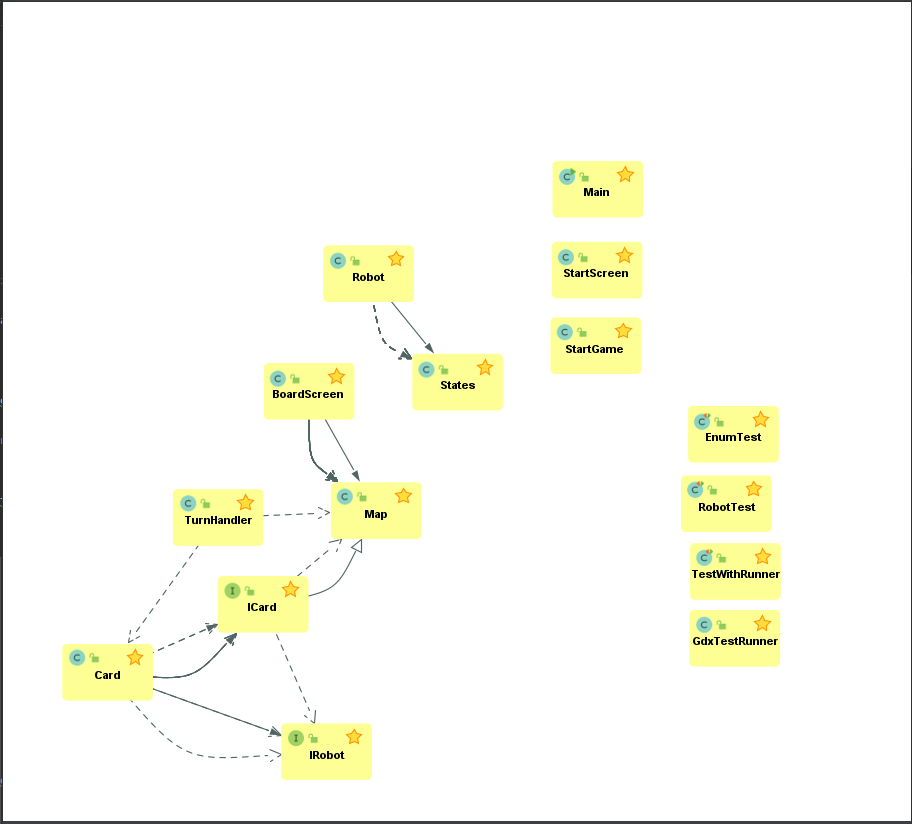

#Obligatorisk oppgave 3 
##Deloppgave 1: Team og prosjekt
- Referat fra møter siden forrige leveranse skal legges ved.
     
        Se Møtereferat.md i Deliverebles
    
- Hvordan fungerer rollene i teamet? Trenger dere å oppdatere hvem som er teamlead eller kundekontakt?

        Vi føler de fungerer bra, vi har merket at vi går etter styrker og vi
        utfyller hverandrer der vi trenger det.
        
- Er det noen erfaringer enten team-messig eller mtp prosjektmetodikk som er verdt å nevne? Synes teamet at de valgene dere har tatt er gode? Hvis ikke, hva kan dere gjøre annerledes for å forbedre måten teamet fungerer på?

        Det har vært litt uorden nå i det siste, med tanke på det som har skjedd de siste ukene.
        Men oppgave messig så har det gått gankse greit. 
    
- Gjør et kort retrospektiv hvor dere vurderer hva dere har klart til nå, og hva som kan forbedres. Dette skal handle om prosjektstruktur, ikke kode. Dere kan selvsagt diskutere kode, men dette handler ikke om feilretting, men om hvordan man jobber og kommuniserer.

        Nå er vi ferdig med grunn muren for oppgaven, og driver mer med det logiske i spillet, samt de litt mer avangserte tingene innen det grafiske, som kort og vise forskjellig kort når vi bytter robot. Men når vi ser tilbake på de siste ukene,
        så ser vi at komunikasjonen har vært dårlig. Vi ser også at det er mye som er gjort av en eller to personer i gruppa og andre får ikke gjort så mye.
    
- Bli enige om maks tre forbedringspunkter fra retrospektivet, som skal følges opp under neste sprint.

        Vi må bli bedre på å kommunisere
        og vi må bli bedre på å fordele arbeide mellom medlemmene
        
- Forklar kort hvordan dere har prioritert oppgavene fremover. Legg ved skjermdump av project board ved innlevering.

      Til denne innleveringen har vi fokusert på:
      - få flere roboter på brettet
      - Damage; sånn at spilleren tar skade, og ikke bare dør
      - Meny skjerm
      
      til neste gang skl vi fokusere på;
      - Forbedre kort mekaniken
      - Turnhandler
      - Belts
    
- Hvordan fungerer gruppedynamikken og kommunikasjonen?

        De siste ukene har det gått dårlig siden det har vært hjemmekontor og isolasjon. men vi skal fokusere på å få fikset dette fremover og få dette til å fungere bedre. 

##Deloppgave 2: Krav
- Oppdater hvilke krav dere har prioritert, hvor langt dere har kommet og hva dere har gjort siden forrige gang.

        Til denne innleveringen har vi prioritert å få til kort og bevege spilleren med kort, samt det å få flere spillere på brettet med sine egne kort.
        Dette mener vi at vi har fått til ganske bra. Det er fortsatt noen små ting som må fikses, men det er ganske greit og funksjonibelt akkurat nå.
        
- For hvert krav dere jobber med, må dere lage
    1) ordentlige brukerhistorier, 
    2) akseptansekriterier og 
    3) arbeidsoppgaver.
    
  Husk at akseptansekriterier ofte skrives mer eller mindre som tester
  
      
      Forrige krav:
      Implementere meny og kort
      Brukerhistorier:
        Som spiller trenger jeg en meny for å velge 
      Akseptansekriterer:
        Klare å skille mellom menyen og spillet
        Klare å skille mellom de forskjellige menyvalgene 
      Arbeidsoppgaver:
        Lage primitive scener
        Lage turn handler
      Implementere en form for kort
      Brukerhistorier:
        Som spiller trenger jeg kort slik at jeg kan styre roboten min
        Som robot trenger jeg kort slik at jeg kan bevege meg i henhold til spillereglene
      Akseptansekriterier:
        Kort skal ha en innvirkning på en robot
        Kort skal ha en spesifikk instruksjon
      Arbeidsoppgaver
        Implementere en abstrakt klasse som kan initialiseres som et hvilket som helst kort fra det ekte spille
        Lage turn handler som kan flytte brikkene basert på kortenes effekt
        
      Oppdatering: 
      Kort og meny er ferdig
      
      Nye krav:
      Turnhandler
      Burkerhistorier:
        Som spiller trenger jeg en turnhandler for at spillet vil utføre handlingene/kortene jeg legger i registeret
        Som robot trenger jeg en turnhandler for å bestemme når jeg skal flyttes i forhold til andre spillere
      Akseptansekriterier:
        Turnhandleren flytter brikkene i hennhold til reglene i roborally
      Arbeidsoppgaver:
        Fullføre implementasjon av Turnhandler klasse, som innbærer å:
        - ha et register for hver robot i spillet
        - bruke prioritetene til kortene for å bestemme rekkefølge
        - implementere funktionalitet til conveyor belt og lasere (og andre brikker)
    
- Dersom dere har oppgaver som dere skal til å starte med, hvor dere har oversikt over både brukerhistorie, akseptansekriterier og arbeidsoppgaver, kan dere ta med disse i innleveringen også.
- Forklar kort hvilke hovedkrav dere anser som en del av MVP og hvorfor. Hvis
 det er gjort endringer i rekkefølge utfra hva som er gitt fra kunde, hvorfor er dette gjort?
    
       [X] Spillbrett
       [X] Vise en og/eller flere roboter
       [] Flytte en brikke med kort
       [X] Vise flagg og hull på brett
       [X] Kunne dø og vinne
       [] Dele ut kort
       [X] Registrere at en robot har vært innom et flagg
       [] Håndtere konflikter i bevegelser
        
        Vi har valgt å prioritere dette først for å få en grei start for videre utvikling.
 
- Husk å skrive hvilke bugs som finnes i de kravene dere har utført (dersom det finnes bugs). 

        - setDirection in Robot rotates the textures of all the robots rather than just the current
        - Map has a bug where if a robot dies and respawns on a base where another robot is standing,
        they will overlap
        

        Når du stater spillet så vil du få noen WARNIG meldiner i terminalen, disse er bare å se bort ifra, siden de 
        ikke er en direte feil.
        
- Kravlista er lang, men det er ikke nødvendig å levere på alle kravene hvis det ikke er realistisk. Det er viktigere at de oppgavene som er utført holder høy kvalitet. Utførte oppgaver skal være ferdige.

##Deloppgave 3: Produktleveranse og kodekvalitet
- Dere må dokumentere hvordan prosjektet bygger, testes og kjøres, slik at det er lett for gruppelderne å bygge, teste og kjøre koden deres. Under vurdering kommer koden også til å brukertestes.

        For å kjøre spillet så kan du bruke intellij, men så lenge du har lastet ned helle repoet, så skal dette gå fint. når du kjører så må du kjøre main klassen.
        Du trenger ikke noe mer en dette. selve bygge koden blir gjort gjennom codacy og travis. disse tester også.
        Vi har tester som vi har lagd selv, her må du inn på test mappen og kjøre en av de med grønn og rød pil i hjørnet av C symbolet.
        
        Se README.md
    
    
- Prosjektet skal kunne bygge, testes og kjøres på Linux, Windows og OSX.

        Dette tester vi gjennom at vi har både linux, osx og window i gruppen.
    
- Lever klassediagram. (Hvis det er veldig mange klasser, lager dere for de viktigste.)

        Som du ser så står main, StartScreen og StartGame for seg selv. grunne til dette er fordi
        at de blir bare brukt en gang. samt at StartGame, er selve spillet vårt hvor alle scener blir satt.
        disse blir heller ikke brukt noen andre steder. 
        
        Det samme med Robot, denne klassen blir brukt andre steder, men den samhandler ikke med noen andre enn states.
        
        De som du ser til høre er testene våre, disse er selvstendige.
        
        Måten vi fikk denne UMLen på er ved en plug inn som heter codeIris.

- Kodekvalitet og testdekning vektlegges. Merk at testene dere skriver skal brukes i produktet. Det kan være smart å skrive manuelle tester for å teste det som er grafisk.

        Se mappe test, også run, her ligger alle testen som vi har laget så langt.

- Utførte oppgaver skal være ferdige.

- Hvis dere tester manuelt: lever beskrivelser av hvordan testen foregår, slik at gruppeleder kan utføre testen selv.

        Se UserTest.md under test/run. Her ligger det noen få bruker tester, men vi skal lage flere. 

- Under vurdering vil det vektlegges at alle bidrar til kodebasen. Hvis det er stor forskjell i hvem som committer, må dere legge ved en kort forklaring for hvorfor det er sånn. Husk å committe alt. (Også designfiler)

        Denne rundet så har vi prøvd å gjøre det sånn at alle leverer likt, men vi ser at det er noen av oss som har gjort litt mere enn andre. Dette er fordi at disse personene har som oppgave å kode, og de har hatt litt ekstra tid til å gjøre dette. 
