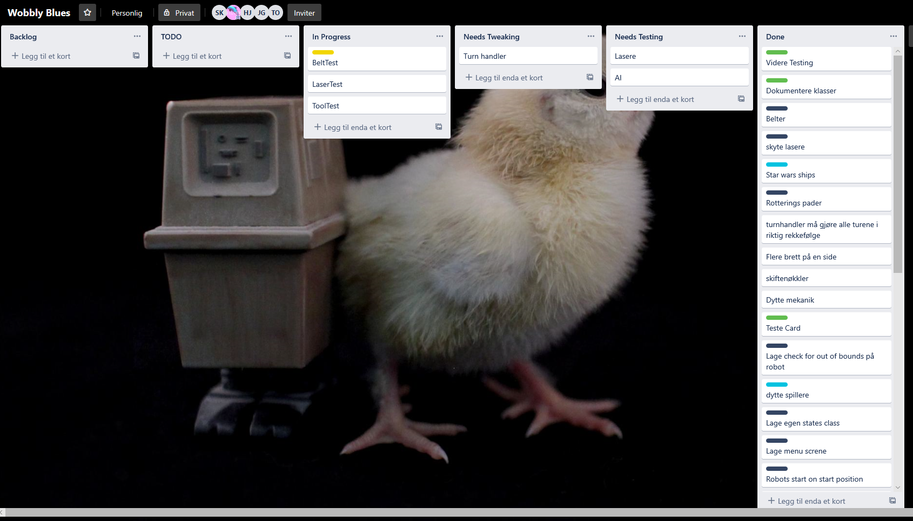
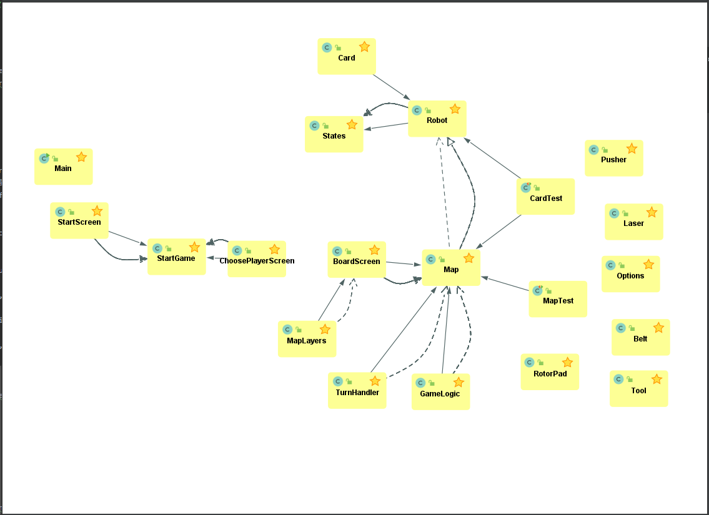

#Obligatorisk oppgave 4 
##Deloppgave 1: Team og prosjekt
- Referat fra møter siden forrige leveranse skal legges ved.

        Se møtereferat.md i Deliverables.

- Hvordan fungerer rollene i teamet? Trenger dere å oppdatere hvem som er teamlead eller kundekontakt?

        Det funket helt greit, men vi har merket at det har vært litt unødvending å fordele roller i et sånn prosjekt 
        siden det er et så lite team og det gjør til at alle gjør litt av alt. 

- Er det noen erfaringer enten team-messig eller mtp prosjektmetodikk som er verdt å nevne? Synes teamet at de valgene
 dere har tatt er gode? Hvis ikke, hva kan dere gjøre annerledes for å forbedre måten teamet fungerer på?

        Team-messig så har vi slitt litt, siden det har blitt flytttet til nettet og det har vi merket at sliter litt på arbeidet.
        Men mtp prosjektmetodikken så har vi valgt den som funker best for oss.
        Vi ser at selv om vi har blitt flyttet til nettbaserte møter så burde vi vært flinkere til å følge opp, og holde kontakt, for å få bedre flytt i arbeidet.

- Gjør et retrospektiv hvor dere vurderer prosjektet har gått. Hva har dere gjort bra, hva hadde dere gjort annerledes
 hvis dere begynte på nytt?

        Vi kunne satt litt oftere møter og litt mere oppfølging. Vi burde snakket litt mere sammen når vi jobbet, siden det ble mye jobbing en og en.
        Utover det så tenker vi at vi hadde gjort det samme, siden det har funger, kanskje ikke optimalt, men det har funket.

- Legg ved skjermdump av project board ved innlevering. Sørg for at det er oppdatert med siste status ved innlevering.

     
     
        Her er en link til projektboardet, og gruppeleder har tilgang til det

- Hvordan fungerer gruppedynamikken og kommunikasjonen nå i forhold til i starten? Hvordan påvirket karantene og
 nedstengning teamet og fremdriften?

        Vi ble ganske har hardt rammet sånn kommunikasjons messig, og selve dynamikken i gruppen ble svekket. dette førte til 
        at an av gruppemedlemmene droppet ut av faget. Dette i seg selv fører jo til at resten av gruppet sliter litt 
        siden vi må gjøre en annens person sine oppgaver sammen med våre egne. Noe som fører til at frem driften i spillet blir dårligere.
        
##Deloppgave 2: Krav
- Oppdater hvilke krav dere har prioritert, hvor langt dere har kommet og hva dere har gjort siden forrige gang

        Denne gangen har vi fokusert på MVP, og gjort en del bugfikser. VI mener at vi har kommet i mål med det, men 
        siden vi mistet en person helt i slutten så manlger vi en del tester. Dette er jo en viktig del av å programere,
        men med bare 3 stykker så var det ikke mulig å komme i mål med programmet og testing. Så vi vurderte det heller viktig at
        vi hadde noe å levere som vi er fornøyd med en å skrive tester, men vi har prøvd å skrive så mange tester som mulig. 

- For hvert krav dere jobber med, må dere lage
 1) ordentlige brukerhistorier,
 2) akseptansekriterier og
 3) arbeidsoppgaver. 
 Husk at akseptansekriterier ofte skrives mer eller mindre som tester 
     - Brukerhistorie: Random Deck of Cards.
            Som spiller vil jeg ha programmeringskort, slik at jeg kan programmere roboten min
          
          - Akseptansekriterier
            
            spiller skal få tilfeldige programeringskort.
            
          - Arbeidsoppgaver:
            
            Generer tilfeldige programmeringskort som spiller kan bruke.
            Spiller skal kunne se kortene som er generert.
            
     -  Brukerhistorie: Conveyor Belts
            Roboten skal bli skyvet av beltene.  
          
          - Akseptansekriterier
           
            Roboten skal bli påvirket av conveyor belts i alle retninger.
    
          - Arbeidsoppgaver:
           
            Legge til conveyor belts visuelt.
            Legge til logikk for conveyor belts.
            
     - Brukerhistorie: Laser
            Som spiller vil jeg at roboten skal ta skade av laseren på brettet.
          
          - Akseptansekriterier
            
            Roboten skal ta skade av laseren som er på brettet og lasere som blir skutt fra roboter
            
- MVP
 - [X] Spillbrett
 - [X] Vise en og/eller flere roboter
 - [X] Flytte en brikke med kort
 - [X] Vise flagg og hull på brett
 - [X] Kunne dø og vinne
 - [X] Dele ut kort
 - [X] Registrere at en robot har vært innom et flagg
 - [X] Håndtere konflikter i bevegelser
 - [X] Roboter og lasere på kunne skyte lasere
 - [X] Delere ut ny kort ved en ny runde
 - [X] Legge igjen en backup
 - [X] Roboter tar skade etter å ha blitt skut av en laser 
 - [X] Tar en robot 9 skade blir den ødelagt og respawner på backupen
 - [X] Kan ikke gå igjnnom en vegg
 - [X] Brenne fast et kort hvis du tar for mye skade 
 - [X] Flytter Roboter ut i fra prioriteringen på kortet

- Husk å skrive hvilke bugs som finnes i de kravene dere har utført (dersom det finnes bugs).

        Det er noen små bugs, som man kan merke til tider, men det er ikke noe som skal være spill ødelegende.
        Men det er også en liten bug kan man kalle det på kortene, siden de ikke er satt opp helt som de skulle vært ifølge reglene.
        Priorteringen kan være litt rar og det kan være flere av de samme kortene.

##Deloppgave 3: Produktleveranse og kodekvalitet
- Dere må dokumentere hvordan prosjektet bygger, testes og kjøres, slik at det er lett for gruppelderne å bygge, teste
 og kjøre koden deres. Under vurdering kommer koden også til å brukertestes.

        For å kjøre spillet så må du kjøre Main klassen under run, og for å teste spillet, så må du kjøre testen som er under test/run

- Prosjektet skal kunne bygge, testes og kjøres på Linux, Windows og OSX.
        
        Dette viser vi gjennom at vi har forkjelige Maskiner som vi bygger selve oppgaven på, og vi tester det også med Travis.

- Lever klassediagram. (Hvis det er veldig mange klasser, lager dere for de viktigste.)

- Under vurdering vil det vektlegges at alle bidrar til kodebasen. Hvis det er stor forskjell i hvem som committer, må
 dere legge ved en kort forklaring for hvorfor det er sånn. Husk å committe alt. (Også designfiler)

        I denne innleveringen så er det stor forskjell på hvem som har gjort hva og med det så merker vi at det er noen 
        som har gjort en del mer enn andre, men ette er fordi at denne situasjoen vi er i nå er vledig spesiel. 
        Samtidg så er den flere på gruppen som er ferdig med de andre fagene sine noe som fører til at de har mere tid
        til å bruke på denne oppgaven.

- Prosjektresentasjonen teller ved denne leveransen. Dere blir vurdert på demo av spillet, en beskrivelse av det
 viktigste dere har lært, en beskrivelse av hvordan nedstengningen av universitetet påvirket prosjektet og hva dere
 ville gjort annerledes nå som dere har mer erfaring med gruppearbeid.

        Gruppen har merket at det har blitt vanskligere å jobbe sammen, og det å begynne å jobbe generelt. Det at vi har 
        måtte jobbet remote har gjort at arbeidslysten har falt siden vi må jobbe mye mer alene. Dette har ført til at fremganeng i utviklingen hargår veldig treigt
        , men det har gått. Det vi tenker at vi kunne gjort anderledes til en annen gang er å ha flere møter og mer oppfølging.
        samt sette skikkelige frister på hva som må gjøres til når. 
        
